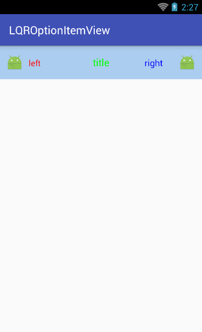
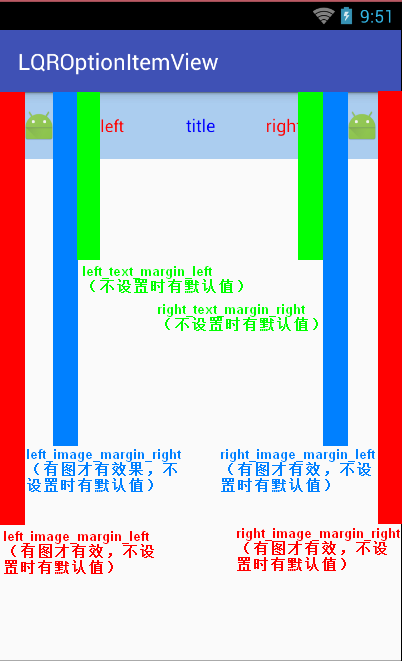

# LQROptionItemView
项目中常用选项条目布局控件

##***一、简述：***
在项目开发中经常遇到类似“设置”功能的需求，一般都要做一些简单的选项条目布局，一个条目可以会用到布局+多个控件（文本或图标），一个条目在xml中布局还算可以接受了，但如果一个设置界面的选项条目有10个，还是一样的布局，这样就显示特别臃肿了吧，而一般一个界面的选项条目有3个以上。为了解决上述问题，本项目诞生了，满足常规的选项条目布局需求，先看下效果。

##***二、使用：***
###1、在自己项目中添加本项目依赖：

	compile 'com.lqr.optionitemview:library:1.0.6'

###2、在布局中使用（属性可选，不设置则不显示）：
一般图标的高度是控件高度的一半，所以没有做该自定义属性，写死了。

	<com.lqr.optionitemview.OptionItemView
        android:id="@+id/oiv"
        android:layout_width="match_parent"
        android:layout_height="60dp"
        android:background="#abcdef"
        app:left_image_margin_left="20dp"
        app:left_image_margin_right="20dp"
        app:left_src="@mipmap/ic_launcher"
        app:left_text="left"
        app:left_text_color="#f00"
        app:left_text_margin_left="20dp"
        app:left_text_size="15sp"
        app:right_image_margin_left="20dp"
        app:right_image_margin_right="20dp"
        app:right_src="@mipmap/ic_launcher"
        app:right_text="right"
        app:right_text_color="#f00"
        app:right_text_margin_right="20dp"
        app:right_text_size="16sp"
        app:title="title"
        app:title_color="#00f"/>
###3、监听左图标和右图标的点击事件

	OptionItemView oiv = (OptionItemView) findViewById(R.id.oiv);
    oiv.setOnOptionItemClickListener(new OptionItemView.OnOptionItemClickListener() {
        @Override
        public void leftOnClick() {
            Toast.makeText(getApplicationContext(), "左图标被点击", Toast.LENGTH_SHORT).show();
        }

        @Override
        public void rightOnClick() {
            Toast.makeText(getApplicationContext(), "右图标被点击", Toast.LENGTH_SHORT).show();
        }
    });

###4、代码动态修改属性

	setTitleText(String text)
	setTitleText(int stringId)
	setTitleColor(int color)
	setTitleSize(int sp)

	setLeftText(String text)
	setLeftText(int stringId)
	setLeftTextSize(int sp)
	setLeftTextColor(int color)
	setLeftTextMarginLeft(int dp)
	setLeftImageMarginLeft(int dp)
	setLeftImageMarginRight(int dp)
	setLeftImage(Bitmap bitmap)
	showLeftImg(boolean flag)
	showLeftText(boolean flag)

	setRightImage(Bitmap bitmap)
	setRightText(String text)
	setRightText(int stringId)
	setRightTextColor(int color)
	setRightTextSize(int sp)
	setRightTextMarginRight(int dp)
	setRightImageMarginLeft(int dp)
	setRightImageMarginRight(int dp)
	showRightImg(boolean flag)
	showRightText(boolean flag)

###5、个别自定义属性解释
